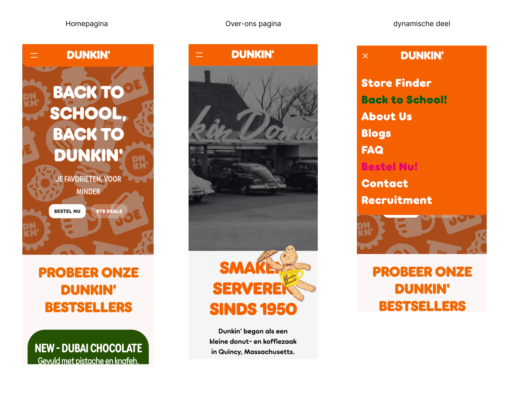
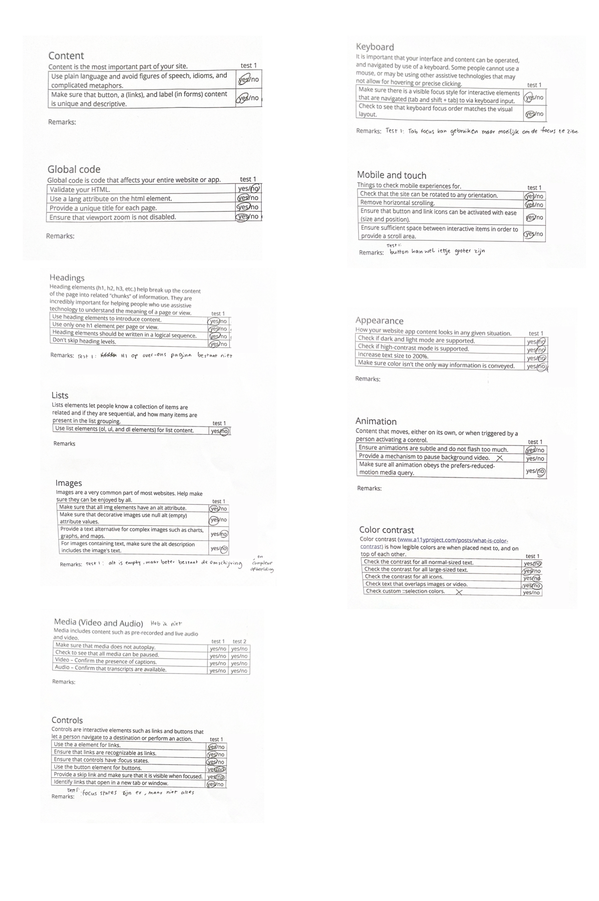
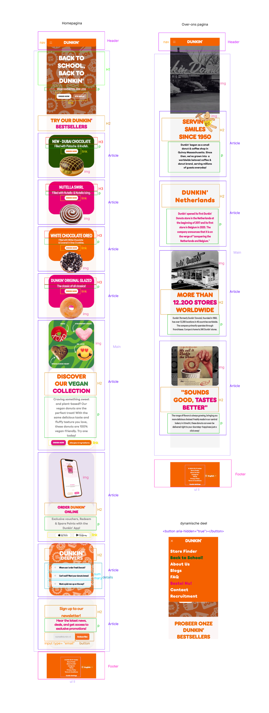
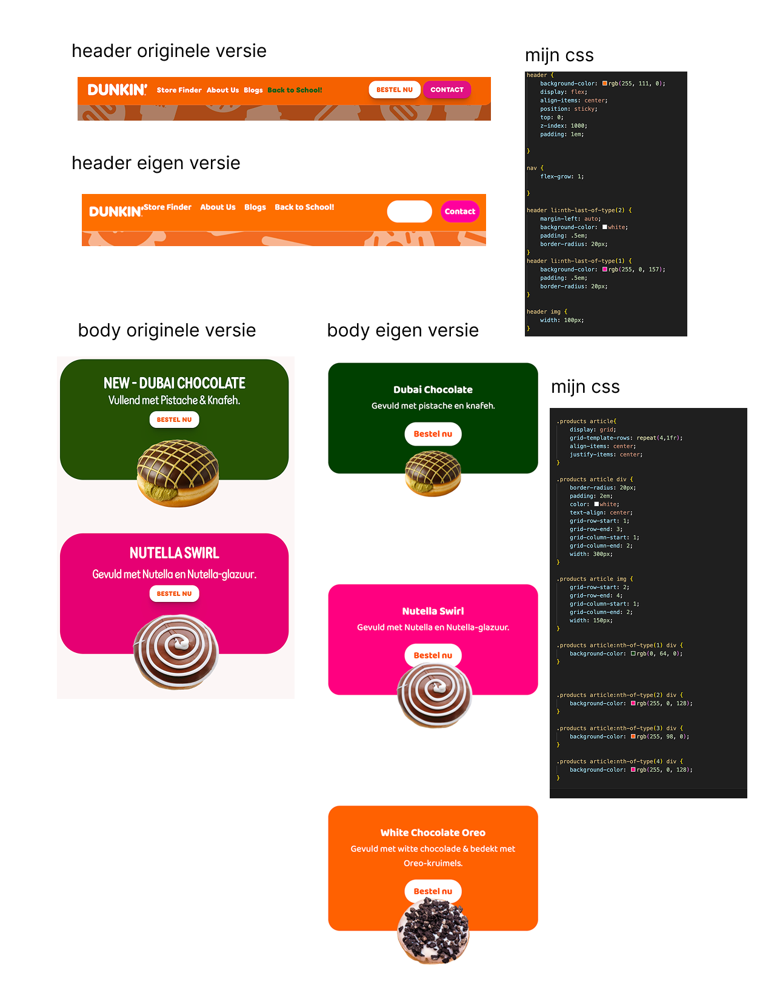
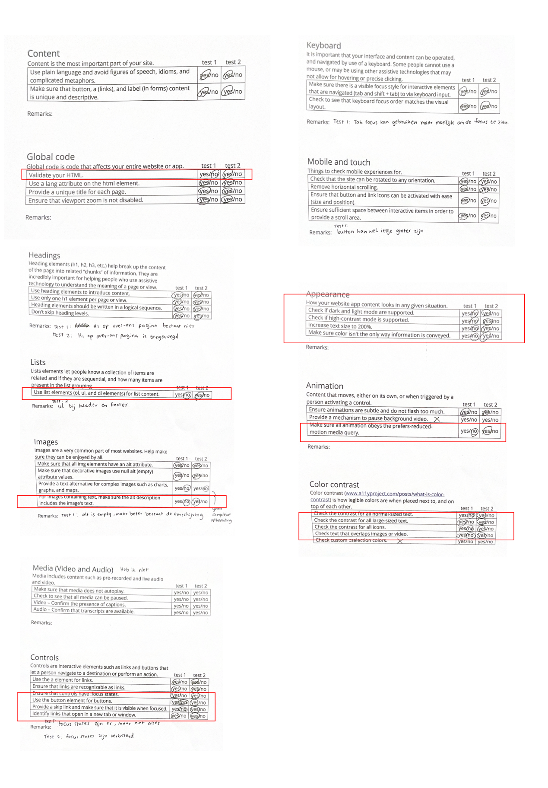
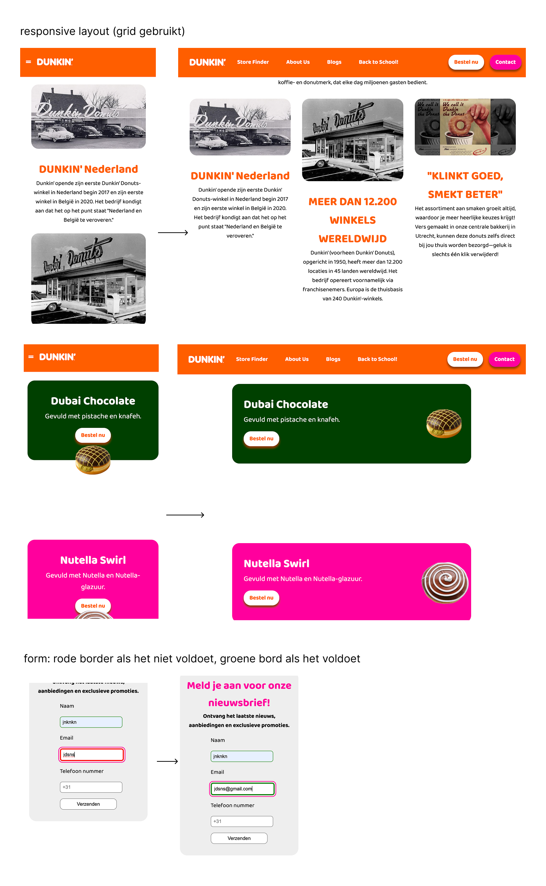
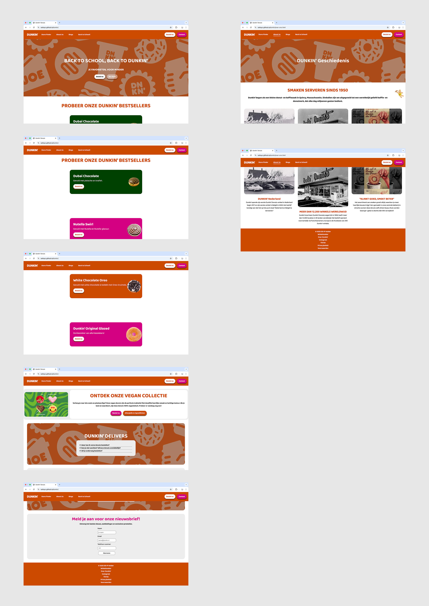
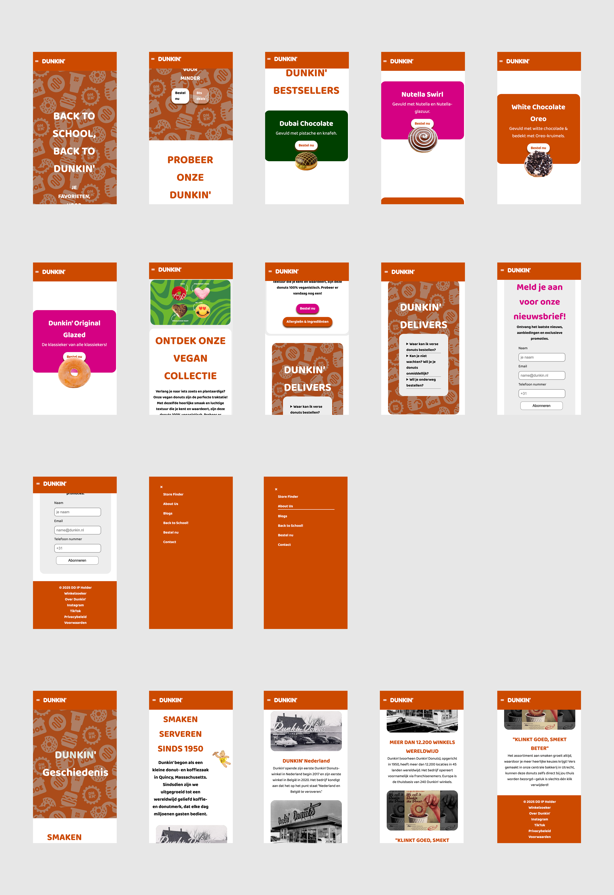
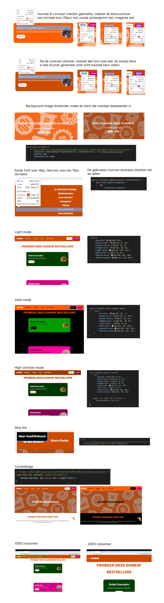
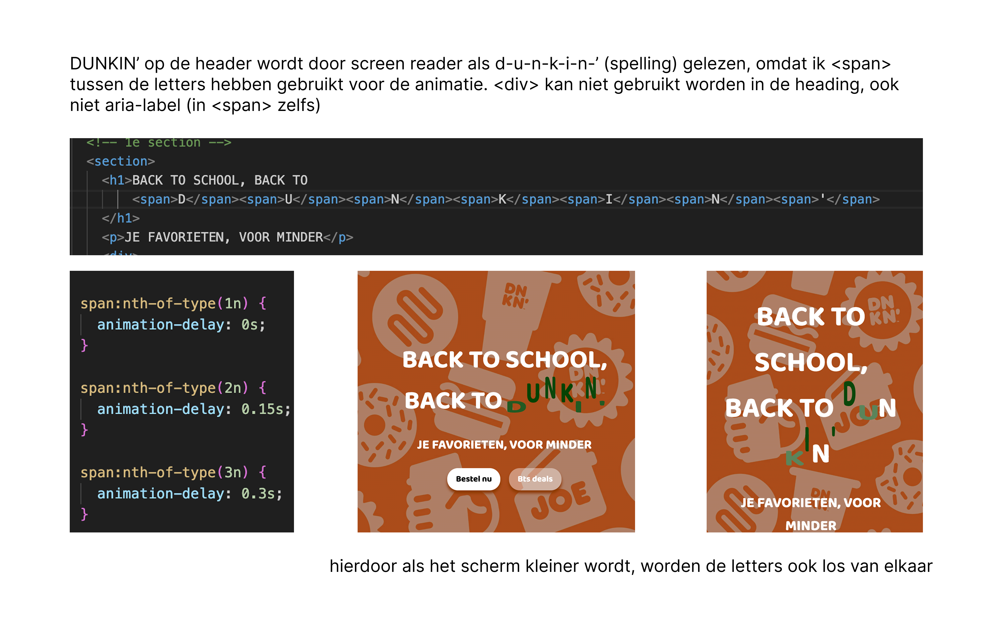

# Procesverslag
Markdown is een simpele manier om HTML te schrijven.  
Markdown cheat cheet: [Hulp bij het schrijven van Markdown](https://github.com/adam-p/markdown-here/wiki/Markdown-Cheatsheet).

Nb. De standaardstructuur en de spartaanse opmaak van de README.md zijn helemaal prima. Het gaat om de inhoud van je procesverslag. Besteedt de tijd voor pracht en praal aan je website.

Nb. Door *open* toe te voegen aan een *details* element kun je deze standaard open zetten. Fijn om dat steeds voor de relevante stuk(ken) te doen.

## Jij

  
uitwerken voor kick-off werkgroep

  ### Auteur:
  Cartoon Sattayarangsan

  #### Je startniveau:
  Rood

  #### Je focus:
Responsive
 

## Je website

  
uitwerken voor kick-off werkgroep

  ### Je opdracht:
  https://www.dunkin.nl/nl/

  #### Screenshot(s) van de paginas: 
  
 

## Toegankelijkheidstest 1/2 (week 1)

  
uitwerken na test in 2e werkgroep

  

  ### Bevindingen
  HTML bestaat heel veel errors.
  De screenreader kan geen afbeelding aflezen, alt is leeg.
  De woorden die in de afbeeldingen zijn, kunnen niet afgelezen worden door screenreader.
  De gebruikers kunnen niet weten wat voor afbeelding het is of wat erin staat.
  Geen logische heading-hiërachie
  Er staat geen skip link, dus de gebruikers kunnen niet meteen naar de main content skippen.
  Geen light/dark mode.
  Font-size kan niet instellen.

## Breakdownschets (week 1)

  
uitwerken na afloop 3e werkgroep

  ### de hele pagina: 
  

## Voortgang 1 (week 2)

  
uitwerken voor 1e voortgang

  ### Stand van zaken
  Het is mij gelukt om html te schrijven, maar het is nog voor mij moeilijk om de header responsive te maken, want nu gaat de kleur van de header niet mee als het scherm kleiner wordt, ook de laatste twee link van header moet ook helemaal aan het einde zijn apart van anderen. Link naar github: https://sattayc.github.io/dunkin/ 
   

## Voortgang 2 (week 3)

  
uitwerken voor 2e voortgang

  ### Stand van zaken
  Ik vond css leuk omdat ik mijn schermen mooier kan maken, maar het is nog ingewikkeld om de codes te begrijpen en toepassen in mijn website.
  
  De header vond ik best ingewikkeld en het lukte me nog niet helemaal om precies de originele site na te kunnen maken, met hulp van docent (Vasilis) kwam ik tot zo ver, ik ga nog proberen om de rest af te maken. 
  De body stukje was ook moeilijk, maar dank aan hulp van studentenasistent heb ik de codes kunnen toepassen in mijn website en nu ziet er best wel goed uit. Voor de rest vond ik de oefenopdrachten best wel te doen, hamburger menu opdracht was ook handig en die kan ik in mijn website toepassen.

  ### Agenda voor meeting
  samen met je groepje opstellen

  | student 1      | student 2          | student 3    | student 4        |
  | ---            | ---                | ---          | ---              |
  | hoe kan ik zo  | en dit             | en ik dit    | en dan ik dat    |
  | min mogelijk   | dit als er tijd is | nog een punt | dit wil ik zeker |
  | class gebruiken?| ...                | ...          | ...              |

  ### Verslag van meeting
  hier na afloop snel de uitkomsten van de meeting vastleggen

  - In plaats van class kan ik nth-of-type gebruiken, dit vind ik super handig
  - Ik zit in de goede richting met de codes
  - Ik heb mijn hamburger menu kunnen toepassen

## Toegankelijkheidstest 2/2 (week 4)

  
uitwerken na test in 9e werkgroep

  

  ### Bevindingen
  Er bestaat focus bij elke link en de screen reader kan de afbeelding ook beter aflezen door de alt die ik heb geschreven.
  Ik heb light/dark, hoge contrast mode toegevoegd, ook kunnen de gebruikers de animaties uitzetten als ze het niet willen (reduced motion).
  Bij de afbeeldingen kan de screen reader goed voorlezen, met al de details dat de gebruikers met visuele beperking kunnen meedenken wat voor plaatjes er zijn, bij de vorige werd het gewoon geskipt dus de gebruikers missen deze informatie.
  Bij de vorige is er geen skip link maar deze keer wel, het is toegangelijker voor de toetsenbord gebruikers die meteen naar de main content kunnen gaan.
 

## Voortgang 3 (week 4)

  
uitwerken voor 3e voortgang

  ### Stand van zaken
  Ik heb mijn website responsive kunnen maken: scherm grootte, reduce animation, skip link, dark mode.
  Vervolgens heb ik de requested formulier ook kunnen toevoegen, dus als je requested veld niet hebt ingevuld krijg je trigger wanneer je op submit button klikt, en als je niet goed hebt ingevuld is de border van die veld rood, als het goed is dan groen.
  Ik heb grid ook gebruikt bij beide pagina.
 

  ### Agenda voor meeting
  samen met je groepje opstellen

  | student 1      | student 2          | student 3    | student 4        |
  | ---            | ---                | ---          | ---              |
  | nog laatste    | en dit             | en ik dit    | en dan ik dat    |
  | verbeterd      | dit als er tijd is | nog een punt | dit wil ik zeker |
  | punten?        | ...                | ...          | ...              |

  ### Verslag van meeting
  hier na afloop snel de uitkomsten van de meeting vastleggen

  - De website is responsive: scherm grootte, layout, skip link, reduce animation en dark mode
  - Footer moet 16px zijn
  - WCAG checklist is gedaan
  - Color contrast moet nog voldoende zijn

## Eindgesprek (week 5)

  
uitwerken voor eindgesprek

  ### Je uitkomst - karakteristiek screenshots:
  
  

  ### Dit ging goed/Heb ik geleerd: 
  

  ### Dit was lastig/Is niet gelukt:
  

## Bronnenlijst

  
continu bijhouden terwijl je werkt

  Nb. Wees specifiek ('css-tricks' als bron is bijv. niet specifiek genoeg). 
  Nb. ChatGpT en andere AI horen er ook bij.
  Nb. Vermeld de bronnen ook in je code.

  1. https://www.gxsoftware.com/nl/blog/zo-zet-je-skiplinks-in-op-je-website
  2. https://css-tricks.com/dark-modes-with-css/
  3. https://developer.mozilla.org/en-US/docs/Web/CSS/@media/prefers-reduced-motion
  4. https://www.svgrepo.com
  5. https://webdevetc.com/blog/how-to-add-a-gradient-overlay-to-a-background-image-using-just-css-and-html
  6. https://developer.mozilla.org/en-US/docs/Web/CSS/Attribute_selectors

